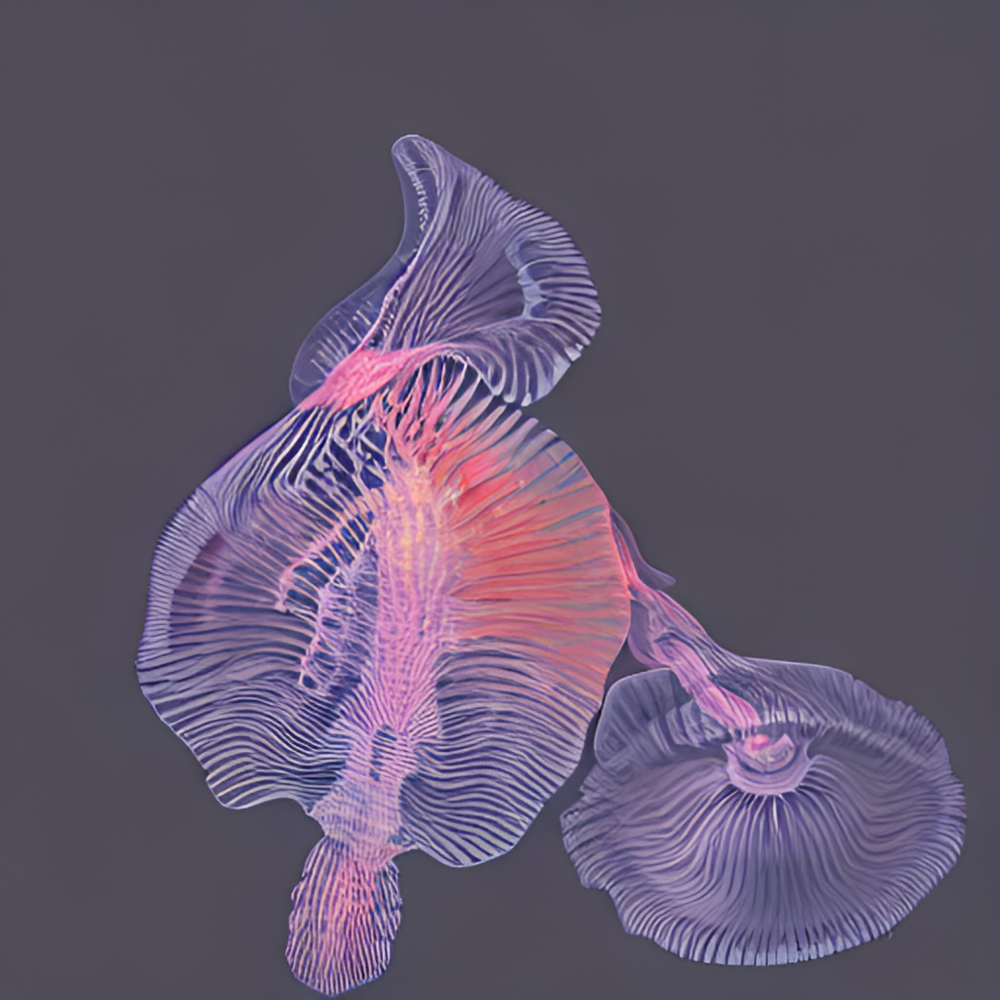
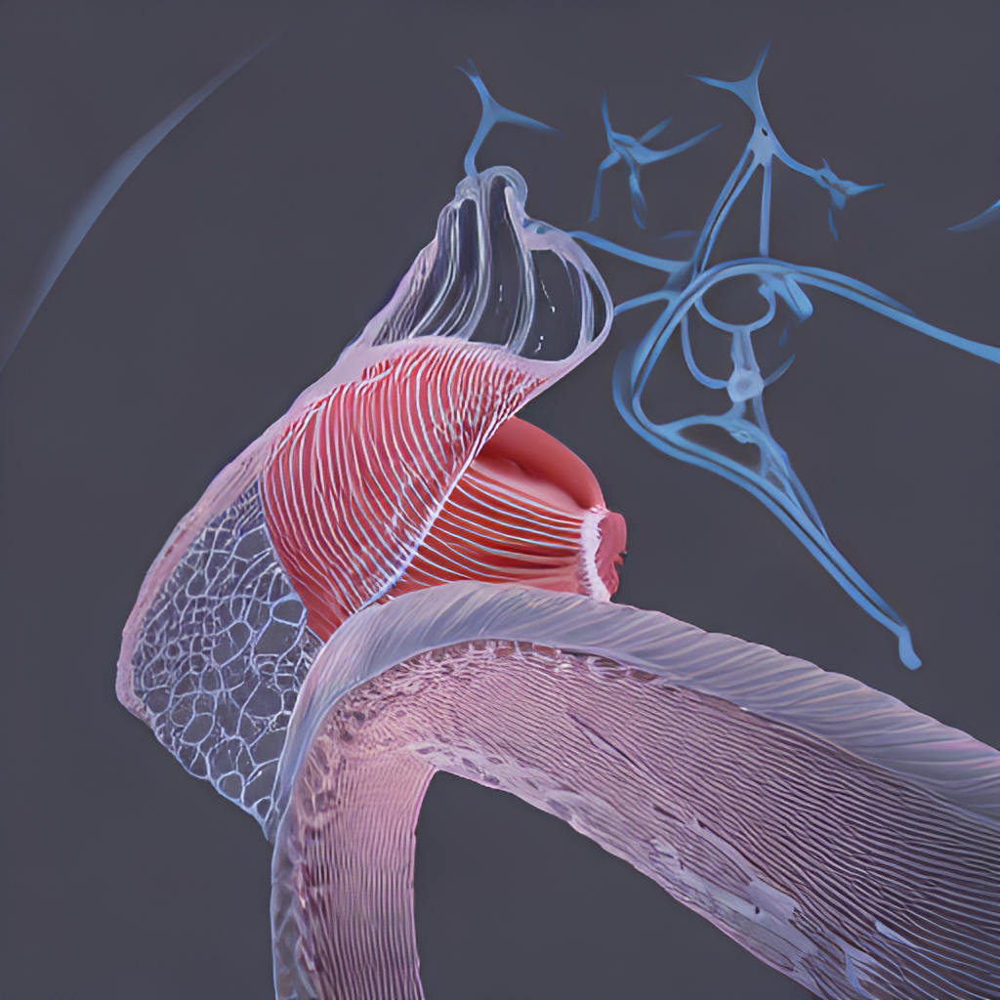
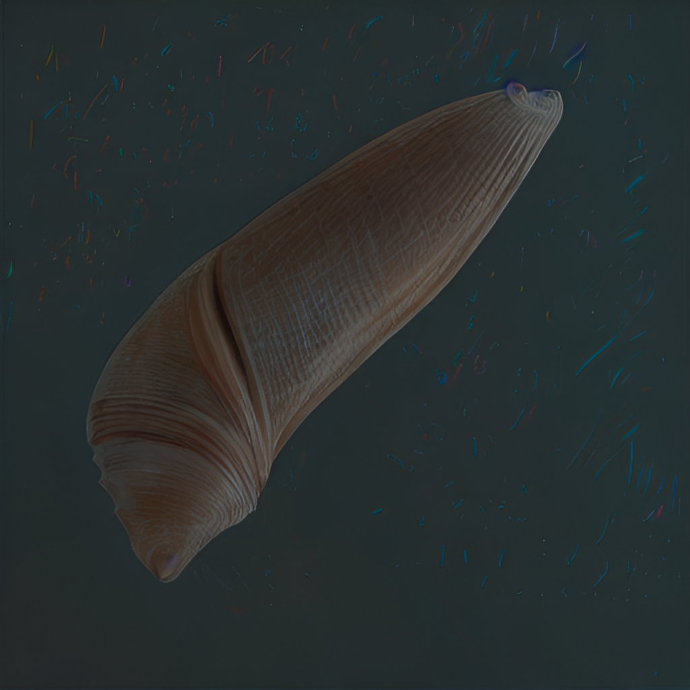

## Samples

### Source Image

| shell pastel xray | shells biological | shells abstract | shell biological |
| -- | -- | -- | -- |
|  |  |  |  |

### Source Image

| shells cellular watercolor | shell xray photo | shell pastels | shells abstract |
| -- | -- | -- | -- |
|  |  |  |  |

### Source Image

| shells cellular abstract | shell photo biological | shell xray | shells biological |
| -- | -- | -- | -- |
|  |  |  |  |

### Source Image

| shell abstract biological | shells watercolor |
| -- | -- |
|  |  | 

### Source Image

| shell abstract |
| -- |
|  |

### Source Image

| shells watercolor | shells abstract | shell biological cellular | shells watercolor drawing |
| -- | -- | -- | -- |
|  |  |  |  |

### Source Image

| shell pastels abstract | shell watercolor drawing | shells drawing | shell photo watercolor |
| -- | -- | -- | -- |
|  |  |  |  |

### Source Image

| shell xray biological | shells watercolor | shells watercolor | shell watercolor biological |
| -- | -- | -- | -- |
|  |  |  |  |